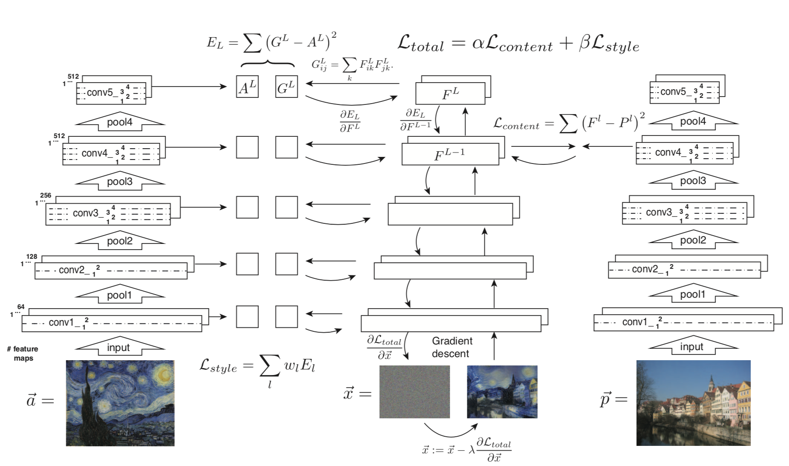

---
author:
- |
    Andrea Battistello\
    Politecnico di Milano\
    [andrea.battistello@mail.polimi.it]{}
- |
    Fabio Chiusano\
    Politecnico di Milano\
    [fabio.chiusano@mail.polimi.it]{}
- |
    Samuele Conti\
    Politecnico di Milano\
    [samuele.conti@mail.polimi.it]{}
bibliography:
- 'reference.bib'
title: Deep Style Transfer
---

Abstract
======

Transferring the style of an image onto another image is a challenging
task. In recent years, Gatys et al. demonstrated the power of
Convolutional Neural Networks (CNN) in combining the content of an image
using the style of another image. Since then, several approaches to
style transfer have been proposed to either extend or improve this
original work. This review aims to provide an overview of the current
progress towards style transfer and a comparative analysis of
state-of-the-art algorithms.

Introduction
============

The problem of synthesizing content by example is a classic problem in
computer vision and graphics. It is of fundamental importance to many
applications, including creative tools such as high-level interactive
photo editing [@Agarwala:2004:IDP:1186562.1015718],
[@Barnes:2009:PRC:1576246.1531330],
[@Hertzmann:2001:IA:383259.383295], as well as scientific
applications, such as generating stimuli in psycho-physical experiments
[@DBLP:journals/corr/GatysEB15]. While this task can be performed by
skilled humans with advanced image manipulation tools, it is not easy to
find an algorithmic counterpart of it. Before the advent of CNNs,
researchers tried to attempt this task with several approaches:

**Stroke-based Rendering**: This approach consists of incrementally
composing virtual strokes (e.g. brush strokes, tiles, stripples) upon a
digital canvas until they match the content image, thus producing
artistic images that resemble the content. However, it’s not possible to
transfer style in a photorealistic setting.[@Hertzmann:1998:PRC:280814.280951]

**Image analogies**: Image analogy aims to learn a mapping between the
content image and the target in a supervised manner. This requires a
dataset with both stylized and unstylized images, which is usually
unavailable in practice. [@Hertzmann:2001:IA:383259.383295]

**Image filtering**: The iterative application of several filters can
achieve the result of a fully stylized image, like in
[@Winnemoller:2006:RVA:1179352.1142018] where this approach is used to
obtain cartoon-like effect. Although straightforward and efficient, this
approach suffer from limited style diversity.

**Texture Synthesis**: In this approach, the style is considered as a
kind of texture. By constraining the semantic of the texture to the
original content image, we can obtain the stylized image by texture
transferring. This approach is used in [@DBLP:journals/corr/GatysEB15],
but suffer from low-level image features, which limits their
performance.

These approaches lack of a higher-level representation of the image and
this is the main reason why CNNs greatly improved the performance of
style transfer algorithms. When CNNs are trained on object recognition,
they develop a high-level representation of an image leveraging on
simple pixel values  [@DBLP:journals/corr/GatysEB15a]. This can be seen
by visualizing the information at each layer via reconstruction from
feature maps [@DBLP:journals/corr/MahendranV14]. This high-level
representation of images is the key observation that marked the
beginning of modern neural style transfer.

Related work
============

Style transfer with CNN
-----------------------

Recently, inspired by the power of Convolutional Neural Network (CNN),
Gatys et al. [@DBLP:journals/corr/GatysEB15a] first studied how to use
CNN to reproduce famous painting styles on natural images. They obtained
the image representations derived from CNN and found that the
representations of image content and style were separable. Based on this
finding, Gatys et al. proposed a Neural Style Transfer algorithm to
recombine the content of a given photograph and the style of well-known
artworks.

![Image as content +
style.[]{data-label="fig:nst_review_1"}](img/ics.png){width="\linewidth"}

The key idea behind this algorithm is to start from random noise as the
initial result and then change the values of pixels iteratively until
the desired statistical feature distribution is satisfied. The CNN
provides a good representation of the image at different layers of
abstraction. In order to transfer the style from an image onto another,
we can define two constraints: the first one is modeled as content loss
(the final image must resemble the content image) and the second one is
the style loss (the final image must have the style of the style image).
Gatys defined style transfer task as to minimize:

 Where:

![\\begin{aligned}
\\mathcal{L}\_{c} = \\sum\_{\\ell = 1}\^{L}\\frac{w\_{c,\\ell}}{2N\_{\\ell}D\_{\\ell}}\\sum\_{i=1}\^{N\_{\\ell}} \\sum\_{p=1}\^{D\_{\\ell}}\\left( F\_{\\ell}\[O\] - F\_{\\ell}\[I\] \\right)\_{ip}\^2
\\\\
\\mathcal{L}\_{s} = \\sum\_{\\ell = 1}\^{L} \\frac{w\_{s,\\ell}}{2N\_{\\ell}\^2} \\sum\_{i=1}\^{N\_\\ell} \\sum\_{j=1}\^{N\_\\ell} \\left( G\_\\ell \[O\] - G\_\\ell \[S\] \\right)\_{ij}\^2\\end{aligned}](https://latex.codecogs.com/png.latex?%5Cbegin%7Baligned%7D%0A%5Cmathcal%7BL%7D_%7Bc%7D%20%3D%20%5Csum_%7B%5Cell%20%3D%201%7D%5E%7BL%7D%5Cfrac%7Bw_%7Bc%2C%5Cell%7D%7D%7B2N_%7B%5Cell%7DD_%7B%5Cell%7D%7D%5Csum_%7Bi%3D1%7D%5E%7BN_%7B%5Cell%7D%7D%20%5Csum_%7Bp%3D1%7D%5E%7BD_%7B%5Cell%7D%7D%5Cleft%28%20F_%7B%5Cell%7D%5BO%5D%20-%20F_%7B%5Cell%7D%5BI%5D%20%5Cright%29_%7Bip%7D%5E2%0A%5C%5C%0A%5Cmathcal%7BL%7D_%7Bs%7D%20%3D%20%5Csum_%7B%5Cell%20%3D%201%7D%5E%7BL%7D%20%5Cfrac%7Bw_%7Bs%2C%5Cell%7D%7D%7B2N_%7B%5Cell%7D%5E2%7D%20%5Csum_%7Bi%3D1%7D%5E%7BN_%5Cell%7D%20%5Csum_%7Bj%3D1%7D%5E%7BN_%5Cell%7D%20%5Cleft%28%20G_%5Cell%20%5BO%5D%20-%20G_%5Cell%20%5BS%5D%20%5Cright%29_%7Bij%7D%5E2%5Cend%7Baligned%7D "\begin{aligned}
\mathcal{L}_{c} = \sum_{\ell = 1}^{L}\frac{w_{c,\ell}}{2N_{\ell}D_{\ell}}\sum_{i=1}^{N_{\ell}} \sum_{p=1}^{D_{\ell}}\left( F_{\ell}[O] - F_{\ell}[I] \right)_{ip}^2
\\
\mathcal{L}_{s} = \sum_{\ell = 1}^{L} \frac{w_{s,\ell}}{2N_{\ell}^2} \sum_{i=1}^{N_\ell} \sum_{j=1}^{N_\ell} \left( G_\ell [O] - G_\ell [S] \right)_{ij}^2\end{aligned}")

 Where  is the total
number of convolutional layers of the used CNN,
 the
number of filters in layer
,
 the
number of activation values of each filter at layer
.
![F\_\\ell\[\\cdot\]\\in\\mathbb{R}\^{N\_\\ell \\times D\_\\ell}](https://latex.codecogs.com/png.latex?F_%5Cell%5B%5Ccdot%5D%5Cin%5Cmathbb%7BR%7D%5E%7BN_%5Cell%20%5Ctimes%20D_%5Cell%7D "F_\ell[\cdot]\in\mathbb{R}^{N_\ell \times D_\ell}")
is a matrix of activation coefficients for each filter.
![G\_\\ell\[\\cdot\]=F\_\\ell\[\\cdot\]F\_\\ell \[\\cdot\]\^{{{\\mkern-1.5mu\\mathsf{T}}}} \\in \\mathbb{R}\^{N\_\\ell \\times N\_\\ell}](https://latex.codecogs.com/png.latex?G_%5Cell%5B%5Ccdot%5D%3DF_%5Cell%5B%5Ccdot%5DF_%5Cell%20%5B%5Ccdot%5D%5E%7B%7B%7B%5Cmkern-1.5mu%5Cmathsf%7BT%7D%7D%7D%7D%20%5Cin%20%5Cmathbb%7BR%7D%5E%7BN_%5Cell%20%5Ctimes%20N_%5Cell%7D "G_\ell[\cdot]=F_\ell[\cdot]F_\ell [\cdot]^{{{\mkern-1.5mu\mathsf{T}}}} \in \mathbb{R}^{N_\ell \times N_\ell}")
is the corresponding Gram matrix,

and

are weights controlling the influence of each layer for respectively
content and style.
 and
 control
the tradeoff between the content and the style. A graphical
representation of the algorithm of Gatys et al. is in figure
\[fig:gatys\].

### Advanced loss-based refinements {#advanced_losses}

Johnson et al. [@Johnson2016Perceptual] showed that adding a total
variation loss produces smoother outputs thus improving style transfer
results:

 = \sum_{x,y}(O_{x,y} - O_{x,y-1})^2 + (O_{x,y} - O_{x-1, y})^2")

 where the sum is over all the
")
pixels of the output image
.

Another addition in the style loss function has been done by Wilmot et
al. [@DBLP:journals/corr/WilmotRB17] who showed that

is unstable and produce output images where the brightness and contrast
vary significantly throughout the image. This is due to not providing
guarantees that the mean or variance of the texture is preserved. To
reduce this instability, they proposed to add an histogram loss:

![\\mathcal{L}\_{hist} = \\sum\_{\\ell=1}\^L \\gamma\_\\ell \\sum\_{i=1}\^{N\_\\ell} \\sum\_{p=1}\^{D\_\\ell} (F\_\\ell \[O\] - R\_\\ell \[O\])\_{ip}\^2](https://latex.codecogs.com/png.latex?%5Cmathcal%7BL%7D_%7Bhist%7D%20%3D%20%5Csum_%7B%5Cell%3D1%7D%5EL%20%5Cgamma_%5Cell%20%5Csum_%7Bi%3D1%7D%5E%7BN_%5Cell%7D%20%5Csum_%7Bp%3D1%7D%5E%7BD_%5Cell%7D%20%28F_%5Cell%20%5BO%5D%20-%20R_%5Cell%20%5BO%5D%29_%7Bip%7D%5E2 "\mathcal{L}_{hist} = \sum_{\ell=1}^L \gamma_\ell \sum_{i=1}^{N_\ell} \sum_{p=1}^{D_\ell} (F_\ell [O] - R_\ell [O])_{ip}^2")

 where

![R\_\\ell \[O\] = \\texttt{histmatch}(F\_\\ell \[O\], F\_\\ell \[S\])](https://latex.codecogs.com/png.latex?R_%5Cell%20%5BO%5D%20%3D%20%5Ctexttt%7Bhistmatch%7D%28F_%5Cell%20%5BO%5D%2C%20F_%5Cell%20%5BS%5D%29 "R_\ell [O] = \texttt{histmatch}(F_\ell [O], F_\ell [S])")

 A different approach was taken by Luan et al.
[@DBLP:journals/corr/LuanPSB17] that tries to consider style transfer
for photorealistic images. In fact, the approach from Gatys et al. does
not work on photos, because it produces effects on the output image that
are not adequate in photorealistic settings because of spatial
inconsistency, which may be acceptable in paintings. To increase
photorealism in style transfer, they constrain the transformation from
the input to the output to be locally affine in colorspace and express
this constraint with a differentiable energy term that acts as a
regularization term.

![\\mathcal{L}\_m = \\sum\_{c=1}\^{3} V\_c \[O\]\^{{{\\mkern-1.5mu\\mathsf{T}}}} \\mathcal{M}\_I V\_c \[O\]](https://latex.codecogs.com/png.latex?%5Cmathcal%7BL%7D_m%20%3D%20%5Csum_%7Bc%3D1%7D%5E%7B3%7D%20V_c%20%5BO%5D%5E%7B%7B%7B%5Cmkern-1.5mu%5Cmathsf%7BT%7D%7D%7D%7D%20%5Cmathcal%7BM%7D_I%20V_c%20%5BO%5D "\mathcal{L}_m = \sum_{c=1}^{3} V_c [O]^{{{\mkern-1.5mu\mathsf{T}}}} \mathcal{M}_I V_c [O]")

 Where  is the
vectorized output image in channel
 and

is a matrix that represents the set of linear standard equations that
minimize the least-squares penalty of the Matting Laplacian (see
[@DBLP:journals/corr/LuanPSB17], [@Levin:2006:CFS:1153170.1153398]  for
reference).

Transfer style from semantically similar patches
------------------------------------------------

The Gram matrix encodes the style of the whole style image: better
results can be obtained by taking the style from the patch in the style
image, whose content is the most similar to the one in the current patch
in the content image. In this way, perturbations from other regions of
the style image can be avoided. In this paper we decided to focus on
this problem since, in our opinion, it’s the one providing the most
sensible results on the output image. As regards the algorithms
presented in the following paragraphs, we will explain only their
contributions related to the problem of finding semantically similar
patches, neglecting other modifications because of space limitations.

### Deep image analogies with Markov Random Fields {#mrf}

Li and Wand [@MRF_patch] built a nearest neighbors Markov Random Field
(MRF) to match content patches to the most semantically similar style
patch.

![Example of Nearest Neighbour Field for finding similar
patches.[]{data-label="fig:nnf"}](img/match.jpg){width="\linewidth"}

In this way we avoid artifacts due to inconsistent style matches. The
matching of pixels from I to S at layer
 is found
with normalized cross-correlation distance:

 = \arg \min_q \frac{N^{\ell}_I(p) N^{\ell}_S(q)}{|N^{\ell}_I(p)| |N^{\ell}_S(q)|}")

 where ") is
the patch around pixel ,
i.e. the matrix of

pixels centered in ,
being  is the size of
the patch. The matching is done with PatchMatch algorithm
[@Barnes:2009:PRC:1576246.1531330], which is a randomized algorithm
faster than brute-force search but empirically proven to provide good
results, and the following loss substitutes the style loss:

 - N^{\ell}_S(\boldsymbol{\psi}_{I \rightarrow S}^{\ell}(p)) \right\lVert ^2")

 Where

is the number of pixels in layer
.

### Bidirectional constraint {#bidir}

Liao et al. improve the nearest neighbor field NNF
[@DBLP:journals/corr/LiaoYYHK17] by considering bidirectional
correspondence between the content and the style image. The algorithm
produces two images from the content image I and the style image S’:

-   I’: content of I, style of S’

-   S: content of S’, style of I

In this way it’s possible to build a better NNF by considering a double
mapping of the patches between the images.

 = \arg \min_q \big( \left\lVert N_{I}^{\ell}(p) - N_{S}^{\ell}(q) \right\lVert ^2 + \left\lVert N_{I'}^{\ell}(p) - N_{S'}^{\ell}(q) \right\lVert ^2 \big)")

![Nearest Neighbour Field built upon the bidirectional constraint
defined in [@DBLP:journals/corr/LiaoYYHK17], explained in
\[bidir\].[]{data-label="fig:bidir"}](img/bidir.png){width="\linewidth"}

### Enforce spatial consistency {#harmonization}

Another approach in improving the patch mapping is the one found in
[@luan2018deep]. At first, an initial guess of the mapping is built
according to [@MRF_patch]. Then, it is improved by adding a bonus
whenever contiguous patches are mapped to contiguous patches. For
example, starting from pixels
 in the content image
, a candidate pixel
 in the style image
 that matches
 is built considering
))"),
where the
")
and ")
functions return respectively the first patch above and under the passed
patch.

![Nearest neighbor field built according to [@luan2018deep], explained
in \[harmonization\]. Similar neighboring patches help in finding a
better
match.[]{data-label="fig:harmony"}](img/van_ben_model_2.png){width="\linewidth"}

Style transfer related challenges
---------------------------------

Several modifications of style transfer algorithms have been devised to
address different challenges. **Fast style transfer**: running the
algorithms from scratch to transfer the same style on different images
seems a waste of resources. Leveraging on this idea,
[@Johnson2016Perceptual] train a neural network on a specific style, so
that it transforms the input image to a new image with same content but
with the style the network was trained on. Therefore, time is spent on
training the neural network so that style transfer can be applied with a
single forward pass. As described by [@DBLP:journals/corr/IsolaZZE16],
another possible approach is provided by using Conditional Adversarial
Networks (cGAN) as a general-purpose solution to image-to-image
translation problems: these networks are not only able to learn a
mapping between input and output images, but also a loss function to
train this mapping. This approach, due to its generality, can be applied
in the same way to many different tasks that would required very
different loss formulations, avoiding the need of hand-engineering both
the mapping and the loss function for the task at hand. **Semantic
augmentations**: [@styletransfer_ca] semantic annotations are proposed
to augment the CNNs architecture for style transfer, in order to obtain
more control over the final outcome and increase its quality.
[@2016arXiv160301768C] builds on a patch-based approach, where the
information of the semantic map is used to compute the nearest-neighbour
patches and contributes to the loss. It also shows that existing
patch-based algorithms require minor adjustments and perform very well
using this additional information. **Video**: [@video] style transfer
can be applied to video too, but special attention must be taken in
enforcing consistency between adjacent frames.

Experiments
===========

Datasets, Experiments setup
---------------------------

We tested state-of-the-art algorithms for style transfer on a set of
common used images for content and style. We ran two types of experiment
to investigate the algorithms. The first experiment uses an
implementation of Gatys et al. and investigates the parameter space that
motivated the choices made by the authors of the paper. The second
experiment, instead, aims to compare the results of several algorithms
on several content and style choices.

Experiment 1: Gatys parameters comparison
-----------------------------------------

{width="\textwidth"}

This experiment aims at exploring the meaning of the parameters involved
in style transfer in the simple and more intuitive implementation of
Gatys et al. [@DBLP:journals/corr/GatysEB15a] We decided to investigate
along the following dimensions: **Content layer**: the layer to use as a
representation of the content. In figure
\[fig:content-style-comparison\] we notice that choosing layer Conv5\_2
gives a more abstract representation of the content, becoming sometimes
blurry and less detailed, while Conv3\_2 bounds the output to be more
similar to the content. Layer Conv4\_2 is a good compromise. **Style
layer**: the layers used to represent the style of the image. We
compared the choice of Gatys et al (column 1) with deeper convolutional
layers in the network. This resulted in more noisy results, meaning that
the style representation in deeper layers is too specific. **Image
initialization**: the initial value of the output image. We can see that
with random initialization we have possibly more artistic results, but
sometimes too noisy because of the lack of a strong constraint on the
content representation. **Optimization algorithm**: we used Adam [@adam]
and L-BFGS [@lbfgs] as optimization algorithms. We can see that L-BFGS
is more suitable to optimize from random initialization than Adam and
possibly gives more artistic results in general. However, such
observations are subject to personal taste. As a general perspective, we
can say that this approach is quite robust to the choice of
hyper-parameters, because almost all the images (with the exception of
the ones started from random) are very similar to each other.

Experiment 2: Algorithms output comparison
------------------------------------------

This second experiment aims at comparing different state-of-the-art
algorithms. We have chosen to compare the naìve but powerful algorithm
from [@DBLP:journals/corr/GatysEB15a], described in \[sec:gatys\], with
other – more complicated – algorithms: MRF [@MRF_patch], described in
\[mrf\], performs an additional matching by building a Markov Random
Field on the activation patches when building the Gram matrix. DPA
[@deep_harmonization], described in \[harmonization\], builds upon this
image and adds another pass with a more constrained MRF patch matching,
plus a histogram and total variation loss. PHOTO
[@DBLP:journals/corr/LuanPSB17] constrains the transformation to lie in
color space using Matting Laplacian as described in section
\[advanced\_losses\]. We tested the behaviour of the algorithms in
different and realistic scenarios: paint-to-photo, photo-to-photo and
painterly harmonization. In the first scenario, we transfer the style of
a paint onto a realistic photo. The second scenario involves the
transfer of the style of a photo onto another photo. The third scenario
adds an extra step of harmonization, where the content is similar to the
style with the except of an extraneous object with a complete different
style. The goal is to smoothly transform the added object to match the
style of the painting. As a result, we can see that the simpler
algorithm form Gatys performs remarkably well on every test with few
exceptions. More complex approaches (PHOTO, MRF and DPA) work really
well on a limited number of images, but fail to generalize on every
domain. Results can be seen in figure \[fig:exp2\]

[0.19]{}

[0.19]{}

[0.19]{}

[0.19]{}

[0.19]{}

Conclusion
==========

Style transfer is a really hot topic in machine learning because of its
many applications in graphics and photo manipulation. Simple approaches
like Gatys et al. work remarkably well on various domains and require
little to no hyper-parameter tuning. Although more advanced approaches
are available and give really good results on some domains, they can
also perform very bad on other domains, questioning whether the more
complex model was necessary in the first place.

More comparisons
================

[0.19]{}

[0.19]{}

[0.19]{}

[0.19]{}

[0.19]{}

Histogram loss
==============

[0.19]{}

[0.19]{}

[0.19]{}

[0.19]{}

[0.19]{}

Histogram loss limits the difference between the histogram of the output
image and the histogram of the output image reconstructed through
histogram matching with the style image. Thus, it forces the output
image to have a color distribution similar to the one of the style
image.

Total variation loss
====================

[0.22]{}

[0.24]{}

[0.24]{}

[0.24]{}

Total variation loss limits the difference of activations of adjacent
pixels and thus produces smoother outputs.
